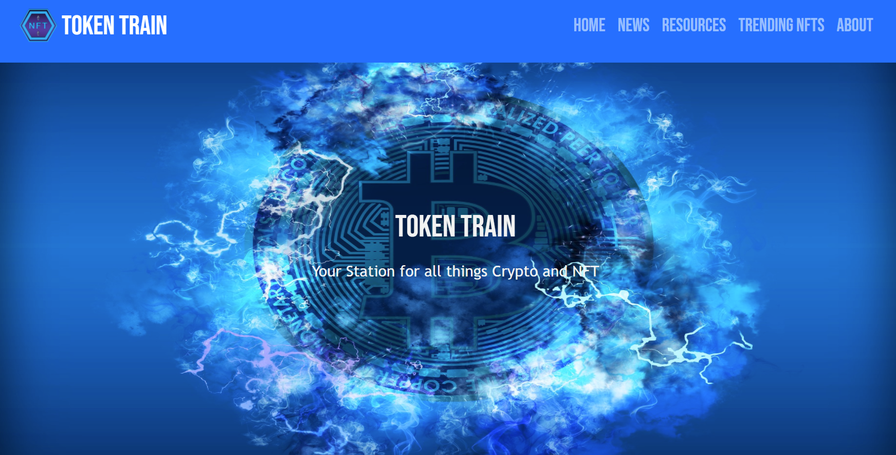
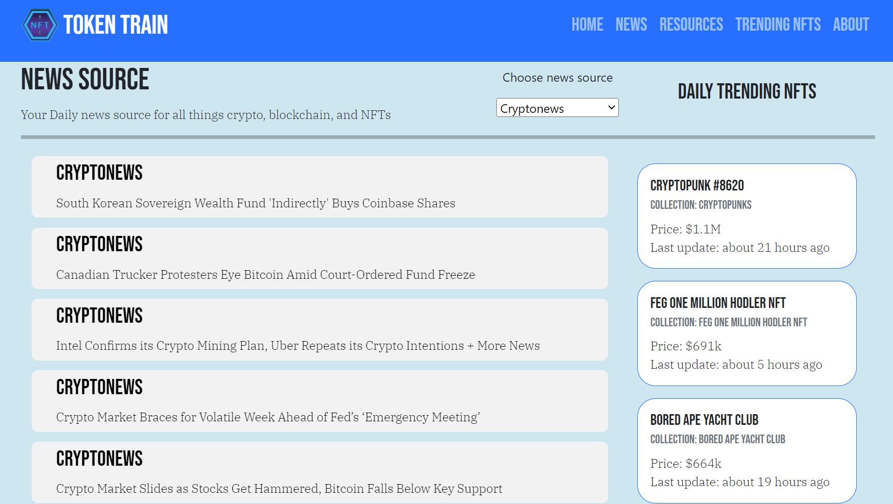
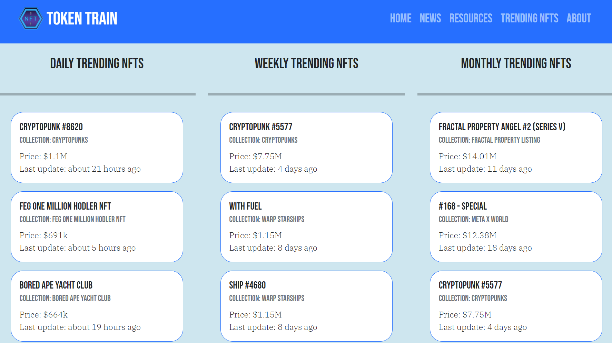
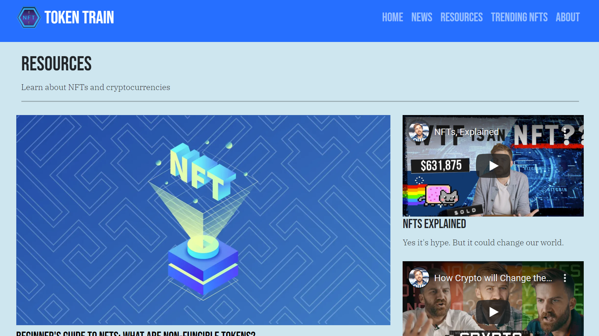

# Token Train: Your station for all things crypto and NFT

## Table of Contents

[Description](#description) | [Features](#features) | [Technology](#technology) | [Installation](#installation) | [Links](#links) | [Screenshots](#screenshots) | [Development Team](#development-team) | [Contributing](#contributing) | [Questions](#questions) | [License](#license)

## Description
Token Train is your station for all things crypto and NFT! This application brings together cryptocurrency news, resources to learn about cryptocurrencies and non-fungible tokens (NFTs), and top NFT sales information. This application utilizes APIs and other sources for information. Token Train was built as part of [Chingu](https://www.chingu.io/) Voyage 36 to give the developers a chance to apply their technical skills and soft skills. 

This site is not regularly maintained and depends on external APIs for news. Users should verify information, seek out current resources and receive appropriate financial advice before making financial decisions.

## Features
- Cryptocurrency news summaries that can be filtered by news source
- Clickable news summaries that will redirect to external articles
- Daily, weekly and monthly trending sales information for NFTs 
- Clickable NFT cards within trending NFTs that will open up a page at [NFT Stats](https://www.nft-stats.com/) to see more information about the NFT
- Resources page with videos and article links to learn more about cryptocurrency and NFTs
- About page that includes information about the developers and application

## Technology
Key technologies and dependencies used in this project:
- HTML
- CSS & SASS
- JavaScript
- Bootstrap &  React Bootstrap
- React (including React Router)

## Installation
1. Fork this project locally
2. Run `npm install` in your bash/command line to install dependencies
3. Subscribe to the following APIs:
    - [Top NFT Sales](https://rapidapi.com/NovusAPI/api/top-nft-sales/)
    - [Blockchain News](https://rapidapi.com/noobbot12367/api/blockchain-news1/)
4. Create a .env file and include a `REACT_APP_RAPID_API_KEY` obtained from [RapidAPI](https://rapidapi.com/)
5. Run `npm run start` in your bash/command line to launch the application

## Links
- [GitHub repository](https://github.com/chingu-voyages/v36-geckos-team-07)
- [Deployed application](https://tokentrain.netlify.app/)

## Screenshots
#### Home Page

#### News Page

#### Trending NFTs Page

#### Resources Page

## Development Team
Mateo Cruz
- [GitHub](https://github.com/cruzma)
- [LinkedIn](https://www.linkedin.com/in/mateo-cruz-b76619133/)

Nwakaego Gift Eze
- [GitHub](https://github.com/e-giftz)
- [LinkedIn](https://www.linkedin.com/in/nwakaegogifteze/)

Daryl Nauman
- [GitHub](https://github.com/darylnauman)
- [LinkedIn](https://www.linkedin.com/in/darylnauman/)

## Contributing
Please contact a member of the development team if you wish to contribute to this application.

## Questions
Please contact any members of our team.

## License
This product is under the MIT License.

